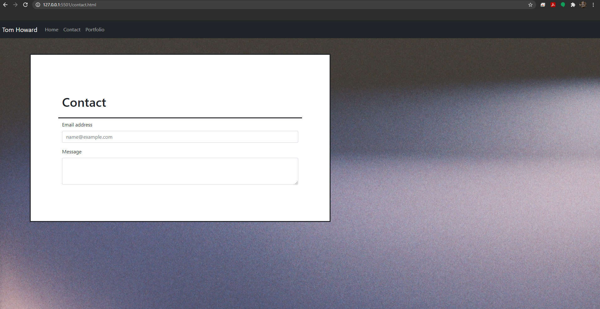
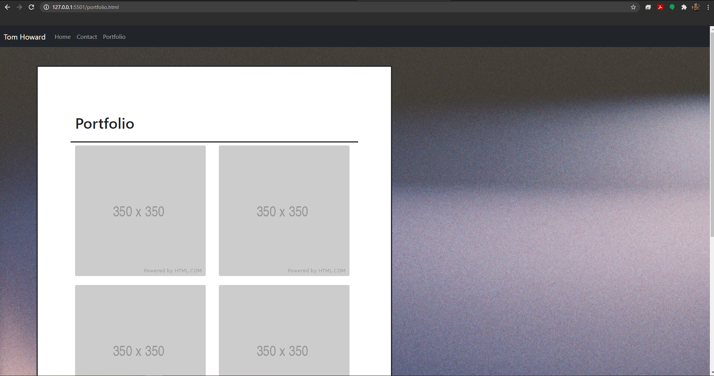

# Homework-2

## Description
In this project I was required to build a portfolio website from the ground up using my knowledge of HTML, CSS, and Bootstrap. Using these tools, I was able to create a basic layout that I will be able to build upon throughout this class

## Takeaways
This project was frustrating but taught me a lot 
* I need to make a better effort to commit and push more often. I often went way too long working locally without commiting
* Proper labeling of classes and IDs will save time, energy, and frustration
* Utilizing bootstraps css will also save you time and a headache
* Starting a project by building the "bones" first and then getting more detailed is much easier and less confusing
* and again, the basics are the most important thing. Stop missing semicolons!

## Screenshot

